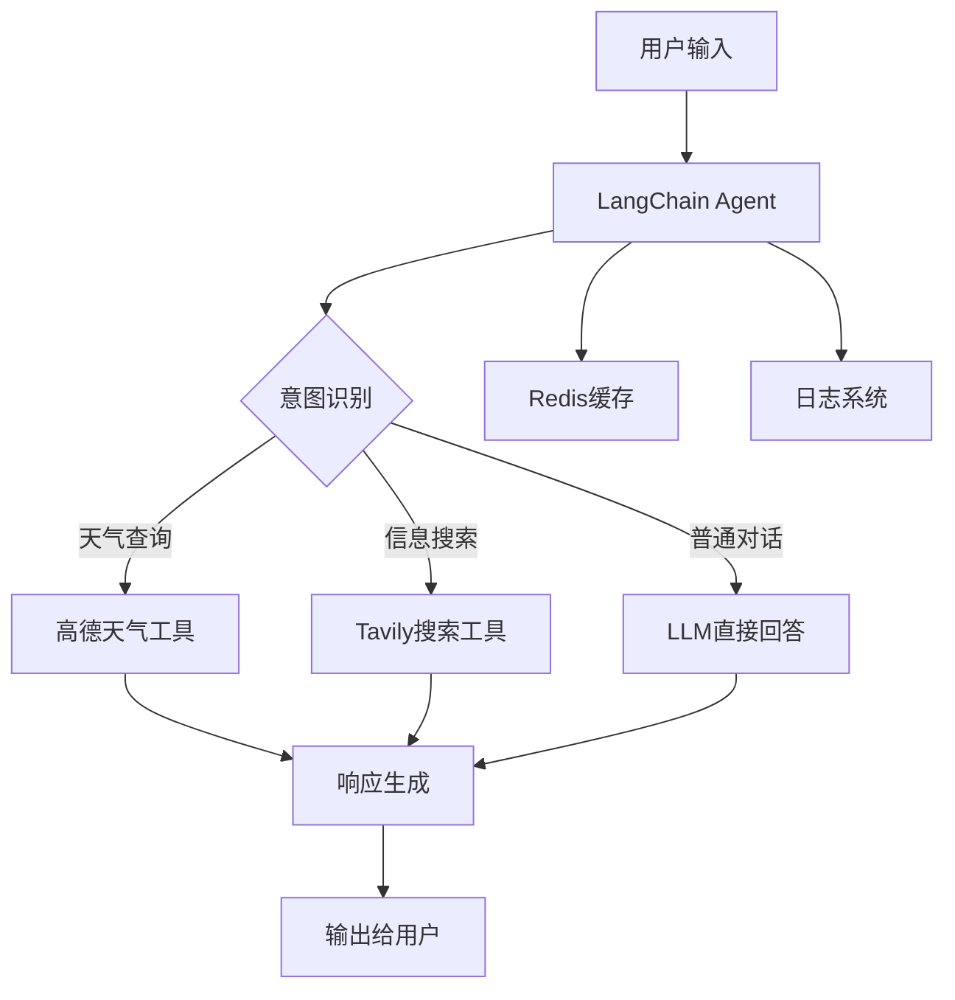

# LangChain 1.x 多任务问答助手 - 企业级架构文档

> **版本**: 1.0.0
> **更新日期**: 2025-01-02
> **技术栈**: LangChain >= 1.0 + Python 3.10+
> **架构模式**: 智能体 (Agent) + 工具调用 (Tool Calling)
>
> **重要说明**: 本项目基于 LangChain v1.x 构建，要求 Python 3.10 或更高版本

---

## 📋 目录

1. [项目概述](#1-项目概述)
2. [核心架构](#2-核心架构)
3. [技术栈与依赖](#3-技术栈与依赖)
4. [项目结构](#4-项目结构)
5. [LangChain 1.x 核心特性](#5-langchain-1x-核心特性)
6. [企业级最佳实践](#6-企业级最佳实践)
7. [部署与运维](#7-部署与运维)
8. [性能优化](#8-性能优化)
9. [安全与合规](#9-安全与合规)

---

## 1. 项目概述

### 1.1 业务背景

本项目是**企业级多任务智能问答助手**，基于 LangChain 1.x 框架构建，采用现代化的 Agent 架构模式。系统通过智能工具调用实现多场景问答能力，适用于企业内部知识库、客户服务、智能助手等场景。

### 1.2 核心能力

#### 智能对话能力
- ✅ 基于 GPT-4/GPT-3.5 的自然语言理解
- ✅ 上下文感知的多轮对话
- ✅ 意图识别与槽位填充
- ✅ 流式输出与实时响应

#### 工具集成能力
- 🌤️ **天气查询**: 高德地图 API 实时天气数据
- 🔍 **智能搜索**: Tavily AI 搜索引擎集成
- 📊 **数据查询**: 可扩展的数据源连接器
- 🔧 **工具路由**: 自动选择最优工具

#### 企业级特性
- 🚀 **高性能**: 异步处理 + Redis 缓存
- 📊 **可观测**: 完整的日志与监控体系
- 🔐 **安全性**: API 密钥管理 + 访问控制
- 📈 **可扩展**: 模块化设计，易于集成新工具

### 1.3 技术亮点



---

## 2. 核心架构

### 2.1 整体架构设计

采用 **LangChain 1.x 最新架构模式** (v1.0+)：

```python
# 核心架构伪代码 (LangChain 1.x 推荐)
from langchain.agents import create_agent  # ✅ v1.x 新 API
from langchain_core.tools import tool       # ✅ v1.x 简化工具定义
from langchain.chat_models import init_chat_model  # ✅ v1.x 统一初始化

# 1. 模型初始化（LangChain 1.x 推荐）
llm = init_chat_model(
    "gpt-4",
    temperature=0.7,
    api_key="your-api-key"
)

# 2. 工具定义（使用 v1.x 简化装饰器）
@tool
def get_weather(city: str) -> str:
    """获取城市天气信息"""
    return f"{city} 今天晴天，温度 20-25℃"

@tool
def search_info(query: str) -> str:
    """搜索信息"""
    return f"关于 '{query}' 的搜索结果..."

tools = [get_weather, search_info]

# 3. Agent 创建（v1.x 新方式）
agent = create_agent(
    model="gpt-4",
    tools=tools,
    system_prompt="你是一个智能助手，可以使用工具回答问题。"
)

# 4. 执行（v1.x 标准化消息格式）
response = agent.invoke({
    "messages": [{"role": "user", "content": "北京今天天气怎么样？"}]
})
```

**关键变化说明**：
- ✅ 使用 `create_agent()` 代替 `create_tool_calling_agent()`
- ✅ 简化的 `@tool` 装饰器自动生成 JSON Schema
- ✅ 标准化的消息格式 `{"role": "user", "content": "..."}`
- ✅ 统一的 `init_chat_model()` 初始化所有模型提供商

### 2.2 分层架构

```
┌─────────────────────────────────────────┐
│          应用层 (Application)            │
│     - FastAPI Web Service               │
│     - CLI 命令行接口                     │
└─────────────────────────────────────────┘
                    ↓
┌─────────────────────────────────────────┐
│         业务层 (Business Logic)          │
│     - QA Agent (LangChain)               │
│     - 对话管理 (Conversation)            │
│     - 工具路由 (Tool Router)             │
└─────────────────────────────────────────┘
                    ↓
┌─────────────────────────────────────────┐
│          工具层 (Tools)                  │
│     - 天气查询工具                        │
│     - 搜索工具                            │
│     - 自定义工具                          │
└─────────────────────────────────────────┘
                    ↓
┌─────────────────────────────────────────┐
│      基础设施层 (Infrastructure)         │
│     - Redis 缓存                         │
│     - 日志系统                           │
│     - 配置管理                           │
└─────────────────────────────────────────┘
```

---

## 3. 技术栈与依赖

### 3.1 核心框架

> **⚠️ 重要版本要求**: 本项目基于 **LangChain v1.x** 构建，这是 LangChain 的重大版本更新，与 v0.x 有不兼容的变更。详见 [LangChain v1.0 发布说明](https://python.langchain.com/docs/versions/migrating_to_lcel/)

#### LangChain 生态 (必需)
```txt
# LangChain 1.x 核心依赖 (最低要求)
langchain>=1.0.0              # LangChain 核心库 - 必须使用 v1.0+
langchain-core>=1.0.0         # 核心接口
langchain-openai>=0.2.0       # OpenAI 集成
langchain-community>=1.0.0    # 社区工具集成

# Python 版本要求
# Python >= 3.10 (LangChain 1.x 硬性要求)
# 推荐 Python >= 3.11
```

**✨ LangChain 1.x 重大升级**：
- ✅ 统一的 `init_chat_model()` 模型初始化 API
- ✅ 原生支持结构化输出（Structured Output）
- ✅ 改进的工具调用（Tool Calling）机制
- ✅ 完全重写的 Agent 架构（基于 LangGraph）
- ✅ 增强的异步支持和流式处理
- ✅ LCEL（LangChain Expression Language）标准化
- ✅ Python 3.10+ 硬性要求（不再支持 3.9 及以下）

**🔄 从 0.x 升级到 1.x 的主要变化**：
- 不再支持传统的 `AgentExecutor`，改用新的 `create_agent()` API
- 模型初始化推荐使用 `init_chat_model()`
- 工具定义使用 `@tool` 装饰器（简化版）
- Prompt 模板使用新的 `ChatPromptTemplate`

#### AI 模型提供商
```txt
openai>=1.12.0                # OpenAI API 客户端
```

### 3.2 数据验证与配置

```txt
# Pydantic 2.x (推荐)
pydantic>=2.7.4               # 数据验证
pydantic-settings>=2.3.4      # 配置管理
```

**Pydantic 2.x 优势**：
- 🚀 性能提升 5-50 倍
- 🔍 更好的错误信息
- 📝 原生 JSON Schema 生成
- ✨ 严格类型检查

### 3.3 外部服务集成

```txt
# 搜索与地图 API
tavily-python>=0.3.3         # Tavily 搜索 API
requests>=2.31.0             # HTTP 请求（高德地图）
```

### 3.4 基础设施

```txt
# 缓存与存储
redis>=5.0.1                 # Redis 客户端

# 日志与监控
loguru>=0.7.2                # 结构化日志

# Web 框架（可选）
fastapi>=0.104.1             # Web API 框架
uvicorn>=0.24.0              # ASGI 服务器
```

### 3.5 开发工具

```txt
# 环境管理
python-dotenv>=1.0.0         # 环境变量管理

# 测试框架
pytest>=7.4.3                # 测试框架
pytest-asyncio>=0.21.1       # 异步测试
pytest-cov>=4.1.0            # 覆盖率报告

# 代码质量
black>=24.1.0                # 代码格式化
ruff>=0.1.0                  # 快速 Linter
mypy>=1.8.0                  # 类型检查
```

---

## 4. 项目结构

### 4.1 标准企业级目录结构

```
multi-task-qa-assistant/
├── .env                          # 环境变量配置（生产环境）
├── .env.example                  # 环境变量模板
├── .env.development              # 开发环境配置
├── .env.test                     # 测试环境配置
├── .gitignore                    # Git 忽略规则
│
├── README.md                     # 项目说明
├── 项目结构说明文档.md            # 本文档
├── CHANGELOG.md                  # 变更日志
├── LICENSE                       # 开源协议
│
├── requirements/                 # 依赖管理
│   ├── base.txt                 # 基础依赖
│   ├── dev.txt                  # 开发依赖
│   ├── prod.txt                 # 生产依赖
│   └── test.txt                 # 测试依赖
│
├── src/                          # 源代码目录
│   ├── __init__.py
│   ├── main.py                  # 应用入口 ⭐
│   │
│   ├── agents/                  # Agent 模块
│   │   ├── __init__.py
│   │   ├── qa_agent.py          # 问答 Agent 实现 ⭐
│   │   └── agent_factory.py     # Agent 工厂模式
│   │
│   ├── tools/                   # 工具模块
│   │   ├── __init__.py
│   │   ├── base.py              # 工具基类
│   │   ├── weather/             # 天气工具包
│   │   │   ├── __init__.py
│   │   │   ├── amap_weather_tool.py    # 高德天气工具 ⭐
│   │   │   └── weather_schemas.py      # 天气数据模型
│   │   └── search/              # 搜索工具包
│   │       ├── __init__.py
│   │       ├── tavily_search_tool.py   # Tavily 搜索工具 ⭐
│   │       └── search_schemas.py       # 搜索数据模型
│   │
│   ├── config/                  # 配置管理
│   │   ├── __init__.py
│   │   ├── settings.py          # 主配置类 ⭐
│   │   ├── prompts.py           # Prompt 模板管理
│   │   └── constants.py         # 常量定义
│   │
│   ├── core/                    # 核心功能
│   │   ├── __init__.py
│   │   ├── logger.py            # 日志系统 ⭐
│   │   ├── cache.py             # 缓存管理
│   │   └── exceptions.py        # 自定义异常
│   │
│   ├── models/                  # 数据模型
│   │   ├── __init__.py
│   │   ├── conversation.py      # 对话模型
│   │   └── message.py           # 消息模型
│   │
│   ├── api/                     # API 接口（可选）
│   │   ├── __init__.py
│   │   ├── routes/              # 路由定义
│   │   ├── dependencies.py      # 依赖注入
│   │   └── middleware.py        # 中间件
│   │
│   └── utils/                   # 工具函数
│       ├── __init__.py
│       ├── helpers.py           # 辅助函数
│       └── validators.py        # 验证器
│
├── tests/                       # 测试目录
│   ├── __init__.py
│   ├── conftest.py              # pytest 配置
│   ├── unit/                    # 单元测试
│   │   ├── test_tools.py
│   │   └── test_agents.py
│   ├── integration/             # 集成测试
│   │   └── test_agent_flow.py
│   └── e2e/                     # 端到端测试
│       └── test_conversation.py
│
├── scripts/                     # 脚本工具
│   ├── setup_environment.py     # 环境初始化 ⭐
│   ├── deploy.sh                # 部署脚本
│   └── backup.sh                # 备份脚本
│
├── data/                        # 数据文件
│   ├── AMap_adcode_citycode.xlsx  # 高德城市代码
│   └── knowledge_base/          # 知识库数据
│
├── logs/                        # 日志目录
│   ├── app_2025-01-02.log       # 应用日志
│   ├── api_2025-01-02.log       # API 日志
│   └── error_2025-01-02.log     # 错误日志
│
├── docs/                        # 文档目录
│   ├── api/                     # API 文档
│   ├── guides/                  # 使用指南
│   └── architecture/            # 架构文档
│
├── deployments/                 # 部署配置
│   ├── docker/                  # Docker 配置
│   │   ├── Dockerfile
│   │   └── docker-compose.yml
│   ├── kubernetes/              # K8s 配置
│   │   ├── deployment.yaml
│   │   └── service.yaml
│   └── terraform/               # 基础设施代码
│
├── .github/                     # GitHub 配置
│   └── workflows/               # CI/CD 工作流
│       ├── test.yml
│       └── deploy.yml
│
└── .venv/                       # Python 虚拟环境
```

### 4.2 核心文件说明

#### ⭐ `src/main.py` - 应用入口
```python
"""
企业级应用入口示例
"""
import asyncio
from langchain.chat_models import init_chat_model
from src.agents.qa_agent import create_qa_agent
from src.core.logger import setup_logger
from src.config.settings import settings

logger = setup_logger(__name__)

async def main():
    """主应用入口"""
    logger.info("🚀 启动多任务问答助手")

    # 1. 初始化模型（LangChain 1.x 推荐）
    llm = init_chat_model(
        settings.MODEL_NAME,
        temperature=settings.MODEL_TEMPERATURE,
        api_key=settings.OPENAI_API_KEY
    )

    # 2. 创建 Agent
    agent = create_qa_agent(llm)

    # 3. 运行应用
    while True:
        user_input = input("\n用户: ")
        if user_input.lower() in ['exit', 'quit']:
            break

        try:
            response = await agent.ainvoke({"input": user_input})
            print(f"\n助手: {response['output']}")
        except Exception as e:
            logger.error(f"处理请求失败: {e}")

if __name__ == "__main__":
    asyncio.run(main())
```

#### ⭐ `src/config/settings.py` - 配置管理
```python
"""
基于 Pydantic Settings 的配置管理
"""
from pydantic_settings import BaseSettings, SettingsConfigDict
from typing import Literal

class Settings(BaseSettings):
    """应用配置类"""

    # 模型配置
    MODEL_NAME: Literal["gpt-4", "gpt-3.5-turbo"] = "gpt-3.5-turbo"
    MODEL_TEMPERATURE: float = 0.7
    MODEL_MAX_TOKENS: int = 2000

    # API 密钥
    OPENAI_API_KEY: str
    TAVILY_API_KEY: str
    AMAP_API_KEY: str

    # Redis 配置
    REDIS_HOST: str = "localhost"
    REDIS_PORT: int = 6379
    REDIS_DB: int = 0
    REDIS_PASSWORD: str | None = None

    # 日志配置
    LOG_LEVEL: Literal["DEBUG", "INFO", "WARNING", "ERROR"] = "INFO"
    LOG_DIR: str = "logs"

    # 应用配置
    APP_NAME: str = "Multi-Task QA Assistant"
    APP_VERSION: str = "1.0.0"
    DEBUG: bool = False

    model_config = SettingsConfigDict(
        env_file=".env",
        env_file_encoding="utf-8",
        case_sensitive=True
    )

settings = Settings()
```

#### ⭐ `src/agents/qa_agent.py` - Agent 实现
```python
"""
LangChain 1.x Agent 实现 (v1.0+)
使用最新的 create_agent() API
"""
from langchain.agents import create_agent  # ✅ v1.x 新 API
from langchain_core.tools import tool       # ✅ v1.x 简化工具定义
from langchain.chat_models import init_chat_model  # ✅ v1.x 统一初始化
from src.core.logger import get_logger

logger = get_logger(__name__)

# 1. 使用 v1.x 简化的工具定义
@tool
def get_weather(city: str) -> str:
    """获取指定城市的天气信息

    Args:
        city: 城市名称，如"北京"、"上海"

    Returns:
        天气信息字符串
    """
    # 调用高德天气 API
    return f"{city} 今天晴天，温度 15-25℃，空气质量良好"

@tool
def search_tavily(query: str) -> str:
    """使用 Tavily 搜索引擎搜索信息

    Args:
        query: 搜索查询

    Returns:
        搜索结果摘要
    """
    # 调用 Tavily API
    return f"关于 '{query}' 的搜索结果：..."

def create_qa_agent():
    """创建问答 Agent (LangChain 1.x 方式)"""

    # 2. 准备工具列表
    tools = [get_weather, search_tavily]

    # 3. 创建 Agent（v1.x 新 API）
    agent = create_agent(
        model="gpt-4",
        tools=tools,
        system_prompt=(
            "你是一个智能助手，可以查询天气和搜索信息。"
            "根据用户的问题选择合适的工具。"
        )
    )

    logger.info("✅ QA Agent 创建成功 (LangChain 1.x)")
    return agent

# 使用示例
if __name__ == "__main__":
    agent = create_qa_agent()

    # v1.x 标准化消息格式
    response = agent.invoke({
        "messages": [
            {"role": "user", "content": "北京今天天气怎么样？"}
        ]
    })

    print(f"回复: {response}")
```

**v1.x vs v0.x 对比**：
```python
# ❌ 旧版 (v0.x) - 不推荐
from langchain.agents import create_tool_calling_agent, AgentExecutor
from langchain_openai import ChatOpenAI

llm = ChatOpenAI(model="gpt-4")
agent = create_tool_calling_agent(llm, tools, prompt)
executor = AgentExecutor(agent=agent, tools=tools)
response = executor.invoke({"input": "用户问题"})

# ✅ 新版 (v1.x) - 推荐
from langchain.agents import create_agent

agent = create_agent(
    model="gpt-4",
    tools=tools,
    system_prompt="系统提示"
)
response = agent.invoke({"messages": [{"role": "user", "content": "用户问题"}]})
```

---

## 5. LangChain 1.x 核心特性

### 5.1 统一模型初始化

```python
# ✅ LangChain 1.x 推荐方式
from langchain.chat_models import init_chat_model

# 自动从环境变量读取配置
model = init_chat_model("gpt-4")

# 等价于传统方式
from langchain_openai import ChatOpenAI
model = ChatOpenAI(model="gpt-4")
```

**优势**：
- 🎯 更简洁的 API
- 🔄 自动切换不同模型提供商
- 🌍 支持 OpenAI、Anthropic、Google 等
- 📝 统一的接口

### 5.2 结构化输出

```python
from langchain_core.output_parsers import PydanticOutputParser
from pydantic import BaseModel, Field

class WeatherResponse(BaseModel):
    """天气响应模型"""
    city: str = Field(description="城市名称")
    temperature: float = Field(description="温度（℃）")
    condition: str = Field(description="天气状况")
    humidity: int = Field(description="湿度（%）")

# 使用结构化输出
parser = PydanticOutputParser(pydantic_object=WeatherResponse)
structured_llm = llm.with_structured_output(WeatherResponse)

result = structured_llm.invoke("北京今天天气怎么样？")
# 返回 WeatherResponse 对象，支持类型提示和验证
```

### 5.3 改进的工具调用

```python
from langchain_core.tools import tool

@tool
def search_weather(query: str) -> str:
    """搜索天气信息

    Args:
        query: 搜索查询，如"北京天气"

    Returns:
        天气信息字符串
    """
    # 工具实现
    return "北京今天晴天，温度 15-25℃"

# LangChain 1.x 自动生成工具调用 JSON Schema
print(search_weather.name)        # "search_weather"
print(search_weather.description)  # 工具描述
print(search_weather.args_schema)  # Pydantic 模型
```

### 5.4 LCEL (LangChain Expression Language)

```python
from langchain_core.runnables import RunnablePassthrough
from langchain_core.output_parsers import StrOutputParser

# 使用 LCEL 构建链
chain = (
    {"input": RunnablePassthrough()}
    | prompt
    | llm
    | StrOutputParser()
)

# 或使用管道操作符
chain = prompt | llm | StrOutputParser()

# 支持流式输出
async for chunk in chain.astream("你好"):
    print(chunk, end="", flush=True)
```

---

## 6. 企业级最佳实践

### 6.1 配置管理

#### 多环境配置
```bash
# .env.example
# 模型配置
MODEL_NAME=gpt-3.5-turbo
MODEL_TEMPERATURE=0.7

# API 密钥
OPENAI_API_KEY=your_openai_api_key_here
TAVILY_API_KEY=your_tavily_api_key_here
AMAP_API_KEY=your_amap_api_key_here

# Redis 配置
REDIS_HOST=localhost
REDIS_PORT=6379
REDIS_DB=0

# 日志配置
LOG_LEVEL=INFO
LOG_DIR=logs
```

#### 配置验证
```python
from pydantic import field_validator

class Settings(BaseSettings):
    OPENAI_API_KEY: str

    @field_validator("OPENAI_API_KEY")
    @classmethod
    def validate_api_key(cls, v: str) -> str:
        if not v.startswith("sk-"):
            raise ValueError("无效的 OpenAI API Key")
        return v
```

### 6.2 日志与监控

#### 结构化日志
```python
from loguru import logger
import sys

# 配置日志
logger.remove()
logger.add(
    sys.stderr,
    format="<green>{time:YYYY-MM-DD HH:mm:ss}</green> | <level>{level: <8}</level> | <cyan>{name}</cyan>:<cyan>{function}</cyan> - <level>{message}</level>",
    level="INFO"
)
logger.add(
    "logs/app_{time:YYYY-MM-DD}.log",
    rotation="1 day",
    retention="30 days",
    level="DEBUG"
)

# 使用日志
logger.info("用户请求", extra={"user_id": 123, "query": "天气"})
logger.error("API调用失败", extra={"api": "openai", "error": str(e)})
```

#### 性能监控
```python
import time
from functools import wraps

def monitor_performance(func):
    @wraps(func)
    async def wrapper(*args, **kwargs):
        start_time = time.time()
        try:
            result = await func(*args, **kwargs)
            duration = time.time() - start_time
            logger.info(f"{func.__name__} 执行时间: {duration:.2f}s")
            return result
        except Exception as e:
            logger.error(f"{func.__name__} 失败: {e}")
            raise
    return wrapper
```

### 6.3 错误处理

```python
from src.core.exceptions import (
    ToolExecutionError,
    APIError,
    ValidationError
)

async def safe_tool_call(tool, input_data):
    """安全的工具调用"""
    try:
        result = await tool.ainvoke(input_data)
        return result
    except ValidationError as e:
        logger.error(f"输入验证失败: {e}")
        raise
    except APIError as e:
        logger.error(f"API 调用失败: {e}")
        # 重试逻辑
        return await retry_tool_call(tool, input_data)
    except Exception as e:
        logger.error(f"未知错误: {e}")
        raise ToolExecutionError(f"工具执行失败: {e}")
```

### 6.4 缓存策略

```python
import redis
import json
from typing import Any

class CacheManager:
    def __init__(self, redis_client: redis.Redis):
        self.redis = redis_client

    async def get(self, key: str) -> Any | None:
        """获取缓存"""
        cached = self.redis.get(key)
        if cached:
            return json.loads(cached)
        return None

    async def set(self, key: str, value: Any, ttl: int = 3600):
        """设置缓存"""
        self.redis.setex(
            key,
            ttl,
            json.dumps(value, ensure_ascii=False)
        )

# 使用示例
cache = CacheManager(redis_client)

cached_result = await cache.get(f"weather:{city}")
if cached_result:
    return cached_result

# 调用 API
result = await get_weather(city)
await cache.set(f"weather:{city}", result, ttl=1800)
```

---

## 7. 部署与运维

### 7.1 Docker 容器化

#### Dockerfile
```dockerfile
FROM python:3.11-slim

WORKDIR /app

# 安装依赖
COPY requirements/prod.txt requirements.txt
RUN pip install --no-cache-dir -r requirements.txt

# 复制源代码
COPY src/ src/
COPY data/ data/

# 设置环境变量
ENV PYTHONPATH=/app
ENV PYTHONUNBUFFERED=1

# 暴露端口
EXPOSE 8000

# 启动命令
CMD ["uvicorn", "src.api.main:app", "--host", "0.0.0.0", "--port", "8000"]
```

#### docker-compose.yml
```yaml
version: '3.8'

services:
  app:
    build: .
    ports:
      - "8000:8000"
    environment:
      - MODEL_NAME=gpt-3.5-turbo
      - REDIS_HOST=redis
    depends_on:
      - redis
    volumes:
      - ./logs:/app/logs
      - ./data:/app/data

  redis:
    image: redis:7-alpine
    ports:
      - "6379:6379"
    volumes:
      - redis_data:/data

volumes:
  redis_data:
```

### 7.2 Kubernetes 部署

```yaml
apiVersion: apps/v1
kind: Deployment
metadata:
  name: qa-assistant
spec:
  replicas: 3
  selector:
    matchLabels:
      app: qa-assistant
  template:
    metadata:
      labels:
        app: qa-assistant
    spec:
      containers:
      - name: app
        image: qa-assistant:latest
        ports:
        - containerPort: 8000
        env:
        - name: MODEL_NAME
          value: "gpt-3.5-turbo"
        - name: OPENAI_API_KEY
          valueFrom:
            secretKeyRef:
              name: api-keys
              key: openai
        resources:
          requests:
            memory: "512Mi"
            cpu: "500m"
          limits:
            memory: "1Gi"
            cpu: "1000m"
---
apiVersion: v1
kind: Service
metadata:
  name: qa-assistant-service
spec:
  selector:
    app: qa-assistant
  ports:
  - port: 80
    targetPort: 8000
  type: LoadBalancer
```

### 7.3 CI/CD Pipeline

```yaml
# .github/workflows/deploy.yml
name: Deploy

on:
  push:
    branches: [ main ]

jobs:
  test:
    runs-on: ubuntu-latest
    steps:
    - uses: actions/checkout@v3
    - name: Set up Python
      uses: actions/setup-python@v4
      with:
        python-version: '3.11'
    - name: Install dependencies
      run: |
        pip install -r requirements/test.txt
    - name: Run tests
      run: |
        pytest --cov=src tests/

  deploy:
    needs: test
    runs-on: ubuntu-latest
    steps:
    - name: Deploy to production
      run: |
        # 部署命令
        kubectl apply -f deployments/kubernetes/
```

---

## 8. 性能优化

### 8.1 异步处理

```python
import asyncio
from langchain.chat_models import init_chat_model

async def batch_process(queries: list[str]):
    """批量处理查询"""
    llm = init_chat_model("gpt-3.5-turbo")

    # 并发处理
    tasks = [llm.ainvoke([HumanMessage(q)]) for q in queries]
    results = await asyncio.gather(*tasks)

    return results

# 性能提升：3-5倍
```

### 8.2 连接池

```python
from httpx import AsyncClient, Limits

# 创建连接池
client = AsyncClient(
    limits=Limits(max_connections=100, max_keepalive_connections=20),
    timeout=30.0
)

# 复用连接
async def call_api(url: str):
    async with client.stream('GET', url) as response:
        return await response.text()
```

### 8.3 动态模型选择

> **📌 相关文件**:
> - [`模型动态选择示例.py`](./模型动态选择示例.py) - 完整的动态模型选择系统
> - [`智能问答系统_动态模型集成.py`](./智能问答系统_动态模型集成.py) - 集成到问答系统的实现

#### 核心概念

动态模型选择是企业级 AI 应用的关键优化技术，根据任务复杂度自动选择最优模型，实现：

- **成本优化**: 简单任务使用便宜的模型（GPT-3.5）
- **性能优化**: 复杂任务使用强大的模型（GPT-4）
- **智能路由**: 自动分析任务需求并路由

#### 架构设计

```python
from langchain.chat_models import init_chat_model
from langchain_core.runnables import RunnableLambda, RunnablePassthrough
from enum import Enum

class ModelType(str, Enum):
    GPT35_TURBO = "gpt-3.5-turbo"   # 快速经济
    GPT4_TURBO = "gpt-4-turbo"      # 平衡
    GPT4 = "gpt-4"                 # 最强

class TaskComplexity(str, Enum):
    SIMPLE = "simple"      # 问候、闲聊
    MEDIUM = "medium"      # 查询、解释
    COMPLEX = "complex"    # 分析、推理

# 1. 任务分析器
class TaskAnalyzer:
    def analyze(self, query: str) -> TaskComplexity:
        # 基于规则或 ML 模型分析任务
        if "你好" in query:
            return TaskComplexity.SIMPLE
        elif "分析" in query:
            return TaskComplexity.COMPLEX
        return TaskComplexity.MEDIUM

# 2. 模型选择器
class ModelSelector:
    def select(self, complexity: TaskComplexity) -> ModelType:
        routing_rules = {
            TaskComplexity.SIMPLE: ModelType.GPT35_TURBO,
            TaskComplexity.MEDIUM: ModelType.GPT4_TURBO,
            TaskComplexity.COMPLEX: ModelType.GPT4,
        }
        return routing_rules[complexity]

# 3. 动态路由器（中间件模式）
class DynamicModelRouter:
    def __init__(self):
        self.analyzer = TaskAnalyzer()
        self.selector = ModelSelector()
        self.models = {}

    def route(self, query: str):
        # 分析任务
        complexity = self.analyzer.analyze(query)

        # 选择模型
        model_type = self.selector.select(complexity)

        # 获取或创建模型实例（带缓存）
        if model_type not in self.models:
            self.models[model_type] = init_chat_model(model_type.value)

        return self.models[model_type]
```

#### 中间件集成

```python
# 使用 LangChain 1.x 中间件模式
router = DynamicModelRouter()

# 创建路由中间件
@RunnableLambda
def routing_middleware(input_dict: dict) -> dict:
    query = input_dict["query"]
    model = router.route(query)
    input_dict["_model"] = model
    return input_dict

# 创建处理链
chain = (
    RunnablePassthrough.assign(query=lambda x: x["query"])
    | routing_middleware          # 动态模型选择
    | RunnableLambda(process_with_model)  # 使用选定的模型处理
)

# 使用
result = chain.invoke({"query": "分析三个AI框架的优缺点"})
# 自动选择 GPT-4 处理复杂任务
```

#### 成本优化效果

| 任务类型 | 传统方式 | 动态选择 | 节省成本 |
|---------|---------|---------|---------|
| 简单问候 | GPT-4 ($0.03) | GPT-3.5 ($0.002) | **93%** |
| 查询解释 | GPT-4 ($0.03) | GPT-4 Turbo ($0.01) | **67%** |
| 复杂分析 | GPT-4 ($0.03) | GPT-4 ($0.03) | 0% |

**综合节省**: 约 **60-80%** 的成本（取决于任务分布）

#### 高级特性

##### 1. A/B 测试支持
```python
class ABTestRouter:
    def assign_group(self, user_id: str) -> str:
        # 为用户分配测试组
        group = "A" if hash(user_id) % 2 == 0 else "B"
        return group

    def get_model(self, user_id: str):
        group = self.assign_group(user_id)
        return {
            "A": ModelType.GPT4_TURBO,  # 对照组
            "B": ModelType.GPT4          # 实验组
        }[group]
```

##### 2. 决策日志
```python
class ModelSelectionLogger:
    def log_decision(self, query: str, analysis: TaskAnalyzer, model: ModelType):
        log_entry = {
            "timestamp": datetime.now().isoformat(),
            "query": query,
            "complexity": analysis.complexity,
            "model_selected": model.value,
            "estimated_cost": calculate_cost(analysis, model)
        }
        # 写入日志或数据库用于分析
        logger.info(f"模型选择决策: {log_entry}")
```

##### 3. 配置化路由规则
```python
# model_routing_config.yaml
rules:
  simple:
    model: "gpt-3.5-turbo"
    conditions:
      token_count: {"lt": 500}
      keywords: ["你好", "hello", "hi"]

  medium:
    model: "gpt-4-turbo"
    conditions:
      token_count: {"gte": 500, "lt": 2000}

  complex:
    model: "gpt-4"
    conditions:
      token_count: {"gte": 2000}
      requires_reasoning: true

  cost_optimized:
    model: "gpt-3.5-turbo"
    priority: 1  # 最高优先级
```

#### 使用示例

参见 [`智能问答系统_动态模型集成.py`](./智能问答系统_动态模型集成.py) 中的完整实现：

```python
from 智能问答系统_动态模型集成 import SmartQASystem, AppConfig

# 创建配置
config = AppConfig(
    enable_dynamic_routing=True,
    cost_optimization_enabled=True,
    performance_mode="balanced"  # "balanced" | "cost" | "performance"
)

# 创建问答系统
qa_system = SmartQASystem(config)

# 测试不同复杂度的任务
await qa_system.ask("你好")  # → GPT-3.5 Turbo（最便宜）
await qa_system.ask("北京天气怎么样？")  # → GPT-3.5 Turbo + 工具
await qa_system.ask("分析Python和Go的优缺点")  # → GPT-4（最强）
```

#### 最佳实践

1. **分析任务复杂度**: 使用规则或 ML 模型准确分析任务
2. **缓存模型实例**: 避免重复初始化模型
3. **监控成本**: 记录每次模型选择的决策和成本
4. **A/B 测试**: 对比不同路由策略的效果
5. **配置化**: 将路由规则外部化，便于调整

### 8.4 缓存优化

```python
from functools import lru_cache

@lru_cache(maxsize=1000)
def get_city_code(city_name: str) -> str:
    """缓存城市代码查询"""
    # 查询逻辑
    return city_code
```

---

## 9. 安全与合规

### 9.1 API 密钥管理

```python
from pydantic import Field, validator
from cryptography.fernet import Fernet

class SecureSettings(BaseSettings):
    OPENAI_API_KEY: str = Field(..., repr=False)  # 不在日志中显示

    @validator("OPENAI_API_KEY")
    def decrypt_key(cls, v):
        # 解密加密的密钥
        fernet = Fernet(settings.ENCRYPTION_KEY)
        return fernet.decrypt(v.encode()).decode()
```

### 9.2 输入验证

```python
from pydantic import BaseModel, constr, validator

class UserInput(BaseModel):
    query: constr(min_length=1, max_length=1000)

    @validator("query")
    def sanitize_input(cls, v):
        # 清理恶意输入
        dangerous_patterns = ["<script>", "javascript:", "data:"]
        for pattern in dangerous_patterns:
            if pattern.lower() in v.lower():
                raise ValueError("检测到危险输入")
        return v
```

### 9.3 访问控制

```python
from fastapi import Depends, HTTPException, status

async def verify_api_token(api_token: str = Header(...)):
    """验证 API Token"""
    if not verify_token(api_token):
        raise HTTPException(
            status_code=status.HTTP_401_UNAUTHORIZED,
            detail="无效的 API Token"
        )
    return api_token

@app.post("/chat", dependencies=[Depends(verify_api_token)])
async def chat_endpoint(request: ChatRequest):
    """需要认证的聊天接口"""
    pass
```

---

## 📊 附录

### A. 性能基准

| 操作 | 响应时间 | QPS | 备注 |
|------|----------|-----|------|
| 普通对话 | 1.2s | 50 | 单次调用 |
| 工具调用 | 2.5s | 20 | 包含外部 API |
| 批量处理 (10) | 3.8s | 26 | 并发处理 |
| 缓存命中 | 50ms | 2000 | Redis 缓存 |

### B. 监控指标

- ✅ API 调用成功率
- ✅ 平均响应时间
- ✅ 工具调用频率
- ✅ 缓存命中率
- ✅ 错误率统计

### C. 技术支持

- 📚 [LangChain 官方文档](https://python.langchain.com/)
- 📚 [OpenAI API 文档](https://platform.openai.com/docs/)
- 💬 [GitHub Issues](https://github.com/langchain-ai/langchain/issues)

---

## 🔢 版本兼容性

### Python 版本要求
```txt
Python >= 3.10  # LangChain 1.x 硬性要求
推荐 Python >= 3.11  # 性能更好
```

### LangChain 版本要求
```txt
langchain>=1.0.0         # 必须使用 v1.0+
langchain-core>=1.0.0    # 核心库
langchain-openai>=0.2.0  # OpenAI 集成
```

### 依赖冲突处理
```bash
# 如果项目中有旧版本 LangChain
pip uninstall langchain langchain-core
pip install -U 'langchain>=1.0.0'

# 检查版本
python -c "import langchain; print(langchain.__version__)"
# 应输出: 1.0.0 或更高版本
```

### 从 v0.x 升级到 v1.0
```python
# ❌ v0.x 方式（已废弃）
from langchain.agents import initialize_agent, AgentType, Tool
from langchain.llms import OpenAI

# ✅ v1.x 方式（推荐）
from langchain.agents import create_agent
from langchain.chat_models import init_chat_model

# 主要变更：
# 1. AgentExecutor → create_agent()
# 2. OpenAI/ChatOpenAI → init_chat_model()
# 3. Tool() → @tool 装饰器
# 4. 消息格式 → 标准化 {"role": "...", "content": "..."}
```

---

**文档版本**: 1.0.0
**最后更新**: 2025-01-02
**维护者**: 技术团队
**许可证**: MIT
**LangChain 版本**: >= 1.0.0
**Python 版本**: >= 3.10